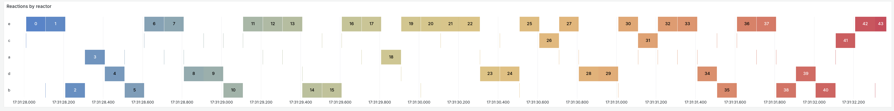
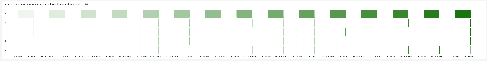
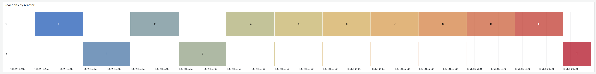
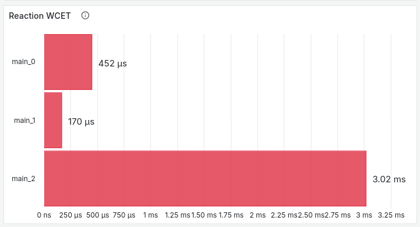
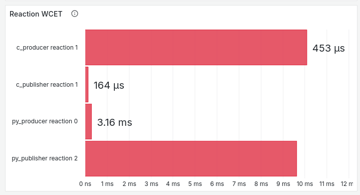

# Changelog

## [8ebc9b5](https://github.com/xronos-inc/xronos-dashboard/tree/8ebc9b504e602259b7ccfe64fc43a0a0e206c573) (2024-08-05)

### Bugfixes

- Update the dashboard to include fixes for incorrect end times and dropped reaction executions that used to appear in the reaction execution timelines.
  - This also changes the panel titled "Reaction executions (opacity indicates logical time and microstep)" to use opacity to indicate logical time and microstep instead of using color to indicate logical time. This can make the panel difficult to read without zooming in, but for technical reasons, it is necessary in order to enable this bugfix.
  - Example 1:
    - Before this bugfix, reaction executions are often dropped or reported as having the wrong execution times, seemingly at random:
      
    - After this bugfix, reaction executions are reported correctly, clearly showing that we periodically execute a 50-millisecond reaction in reactor `a` followed by short-running reactions in the other reactors:
      
  - Example 2 is similar to example 1:
    - Before:
      
    - After:
      
- Fix a bug involving unclear and non-unique names that made the "Reaction WCET" panel difficult to interpret. This panel now reports distinct data for each reaction and does not aggregate data across distinct reactions in the same process.
  - Before:
    
  - After:
    

### Improvements

- Update the dashboard with descriptions to clarify the intended meaning of certain visualizations.
- Rework the time series panel which is now called "Maximum lag by logical time." Notably, this changes it so that the x-axis is logical time, not physical time. We believe that this makes the data in the panel more interpretable, although it can result in data not appearing in the panel when the difference between logical and physical time is large relative to the size of the current time window.
- Remove the panel called "Logical time by reactor." We believe that this panel provides no additional information beyond what now appears in the panel titled "Reaction executions (opacity indicates logical time and microstep)." Additionally, the panel can be difficult to understand.
- Add a panel that reports the frequency of deadline misses per reactor.

### Non-dashboard changes

- Change variable names in the example programs to avoid naming collisions. A more robust and general fix that uses IDs to distinguish between different programs that use the same FQNs is left for a future PR.
- Add an "examples" directory, including an example that demonstrates correct reporting of deadline violations.
